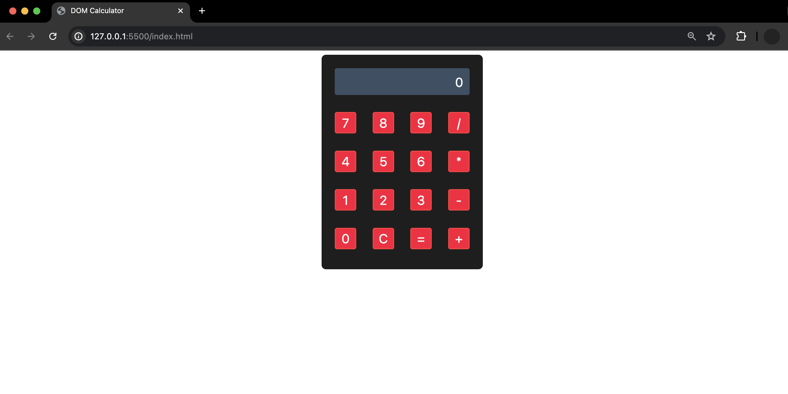

<h1>
  
  DOM Events Lab
</h1>

## About

This lab provides an opportunity to practice DOM manipulation by building a calculator in the browser.

## Content

- [Setup](./setup/README.md)
- [Lab Exercise](./exercise/README.md)

## Deployed sites

🌐 [Live Example](https://pages.git.generalassemb.ly/modular-curriculum-all-courses/dom-events-lab-solution/)